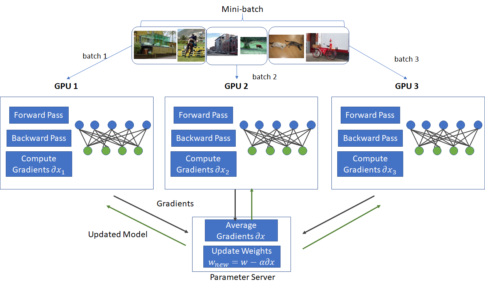
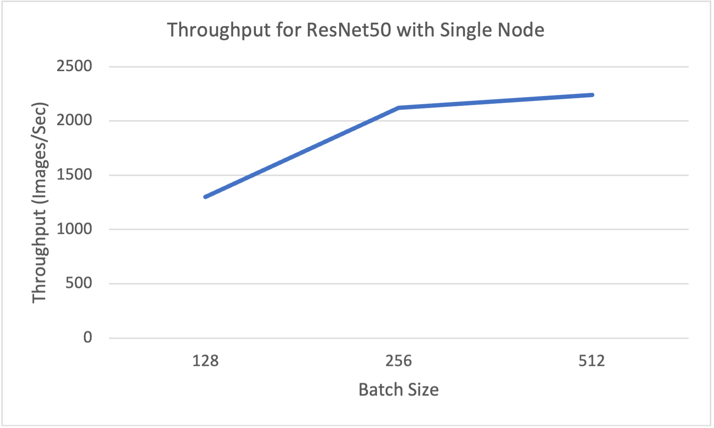
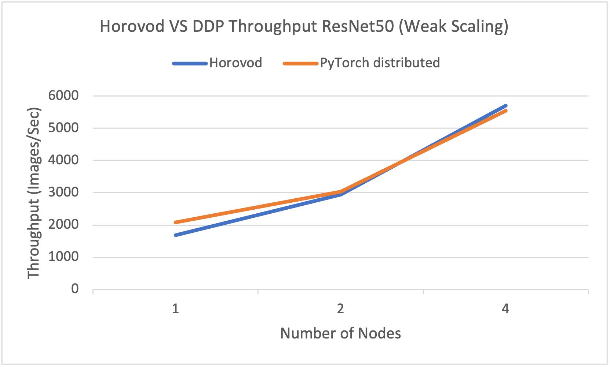
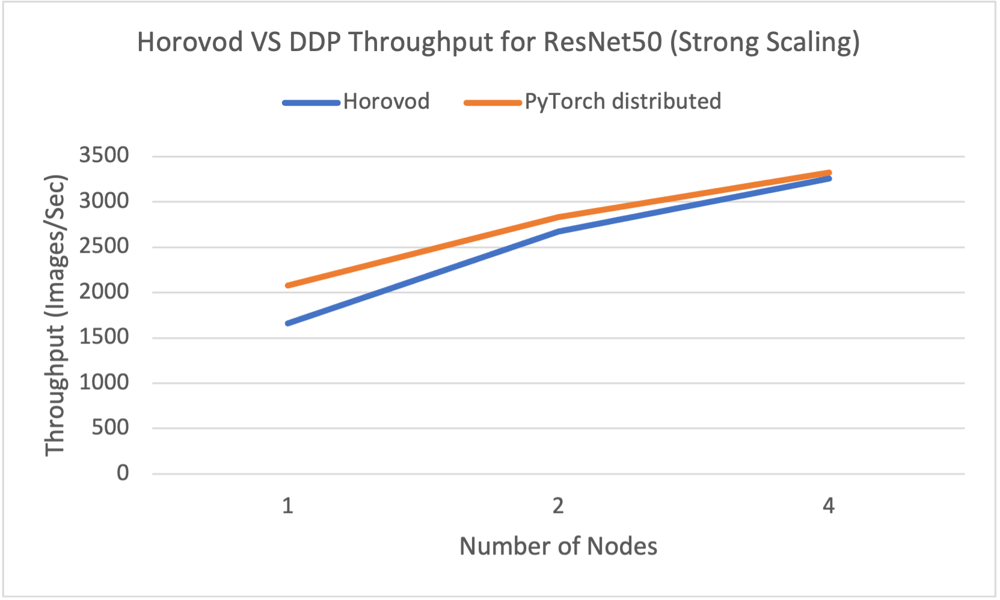

# Data Parallelism using Horovod and DDP

Data Parallelism replicates the model on each GPU (or any processing element) and calculates the gradients independently for its data batch. It then calculates global gradients by taking the average of gradients using the allreduce operation with model replicas.
<div align="center">

<br>
</div>

[Figure Source](https://www.telesens.co/2017/12/25/understanding-data-parallelism-in-machine-learning/)

Horovod for PyTorch Distributed:
Horovod is distributed deep learning framework and provides support not only for Pytorch but also Tensorflow, keras, Apache MXNet. The motivation of Horovod is to make distributed deep learning fast and easy to use by allowing minimal changes in script of single node deep learning

Distributed Data Parallel for Pytorch:
DDP is the class in PyTorch can be used for distributed deep learning and it is based on torch.distributed package. This provides data parallelism and synchronized gradients across each model replica.
This module utilizes multiprocessing where a process is created for each GPU and thus also provides advantage over DataParallel module provided by PyTorch which uses multithreading.

## Performance Evaluation

All the experiments have been performed on [OSC Owens Cluster](https://www.osc.edu/resources/technical_support/supercomputers/owens) with NVIDIA Tesla P100 (Pascal) GPUs. [MVAPICH-GDR](https://mvapich.cse.ohio-state.edu/userguide/gdr/) has been used for GPU communication.

## Single Node
<div align="center">

<br>
</div>
The above experiment shows throughput for ResNet50 using the SVHM dataset, where the highest throughput was observed with a batch size of 512.

### Data Parallelism (Weak Scaling)
<div align="center">

<br>
</div>
The above results show weak scaling experiments for ResNet50 with a batch size of 512 on nodes 1, 2, and 4, using the SVHM dataset.

### Data Parallelism (Strong Scaling)
<div align="center">

<br>
</div>
The above experiments were performed for strong scaling with a batch size of 512 on nodes 1, 2, and 4, using the SVHM dataset."

## Source code
- ResNet_single_node.py is PyTorch implementation for single node.
Example to run script :
```
python ResNet_single_node.py
```
- Pytorch_DDP_ResNet.py is Data Parallelsim using DDP module from PyTorch
Example to run script using slurm srun :
```
$LD PRELOAD /path/to/libmpi.so srun -n ${n} --export ALL,MV2 USE CUD A-1, MV2_ USE_ GDR-0, MV2 DEBUG SHOW BACKTRACE-0, MV2 CUDA BLOCK SIZE- 8388608, MV2 ENABLE_ TOPOAWARE_COLLECTIVES-0,M2_CPU_BINDING POLICY-hybrid,MV2_HYBRID BINDING POLICY=spread python Horovod_DDP_ResNet.py --batch-size 512
```
- Horovod_DDP_ResNet.py is Data Parallelsim using Horovod.
Example to run script using slurm srun  :
```
$LD PRELOAD /path/to/libmpi.so srun -n ${n} --export ALL,MV2 USE CUD A-1, MV2_ USE_ GDR-0, MV2 DEBUG SHOW BACKTRACE-0, MV2 CUDA BLOCK SIZE- 8388608, MV2 ENABLE_ TOPOAWARE_COLLECTIVES-0,M2_CPU_BINDING POLICY-hybrid,MV2_HYBRID BINDING POLICY=spread python Pytorch_DDP_ResNet.py --batch-size 512
```